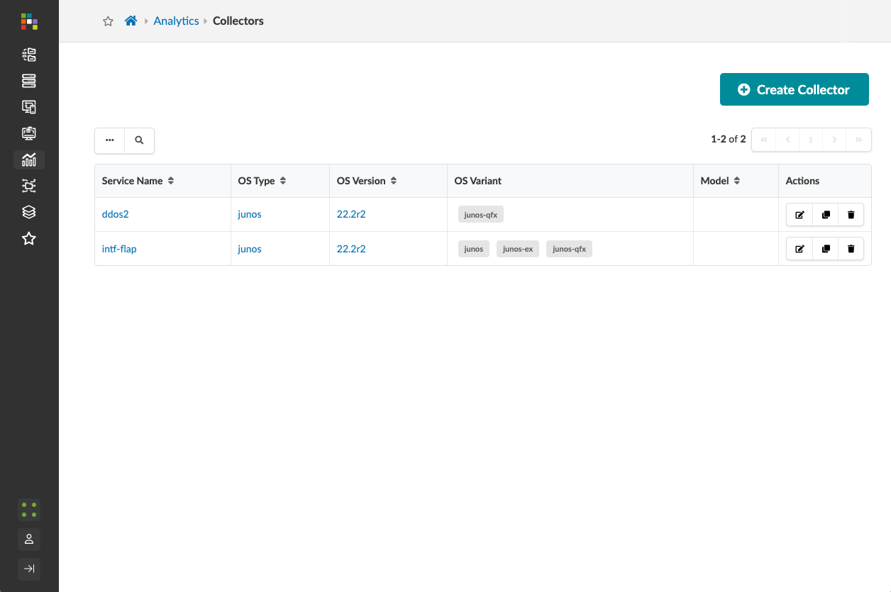
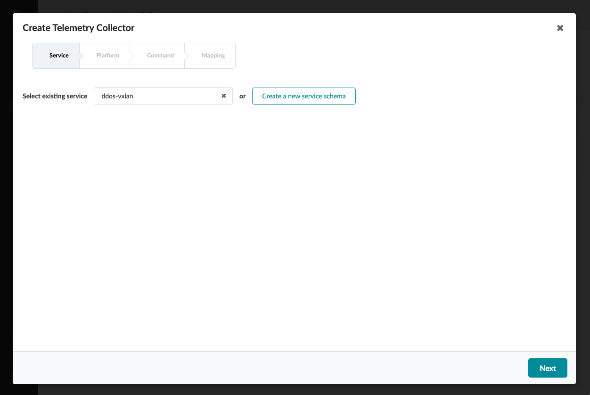
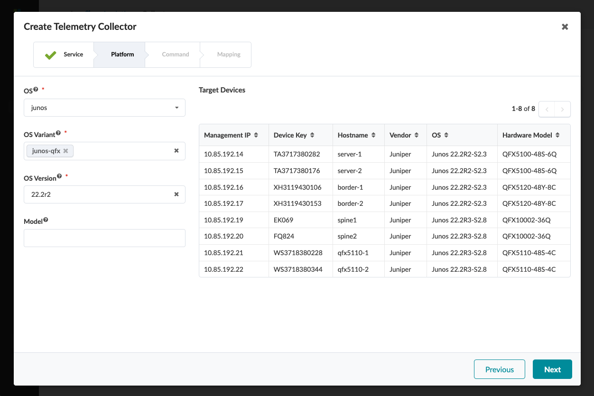
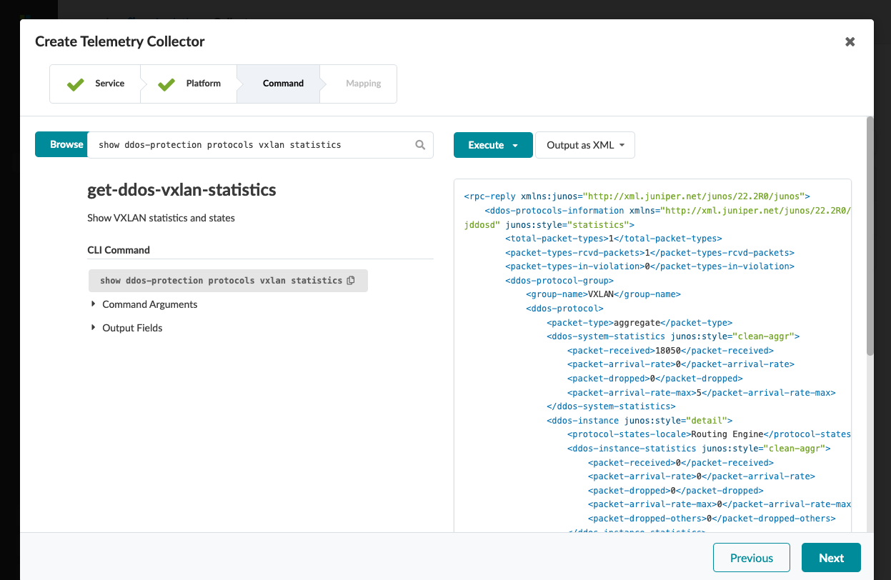
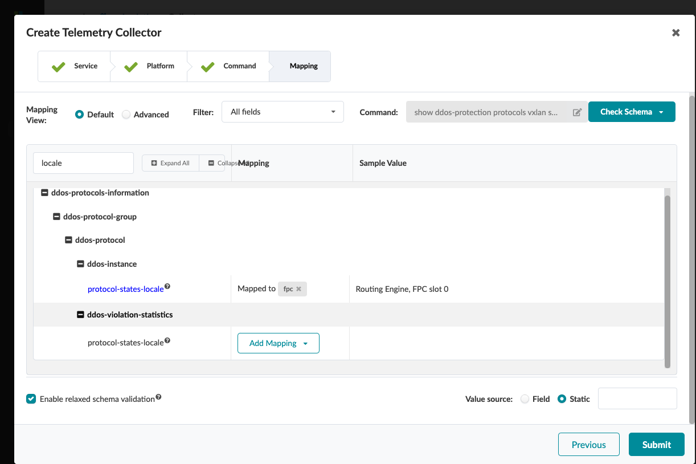
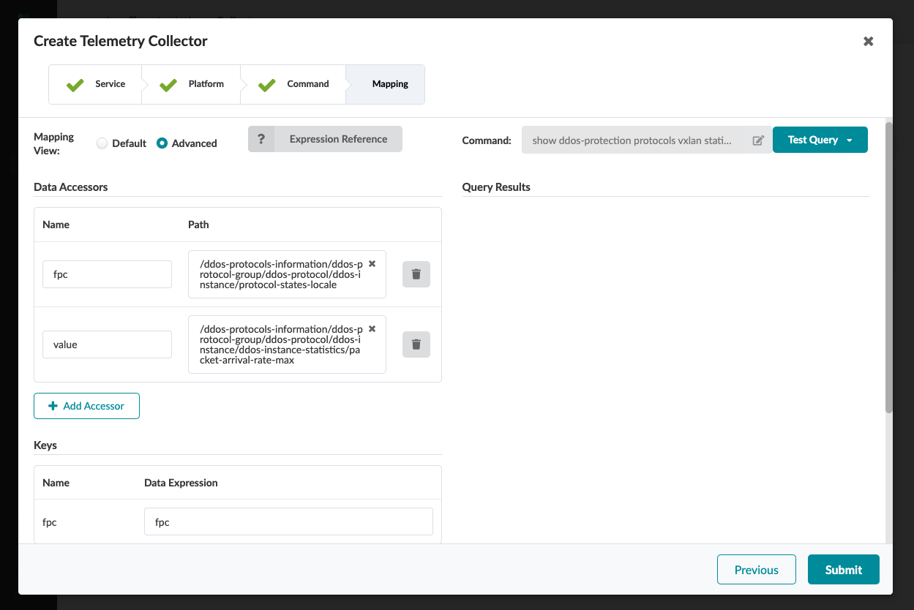

# Collectors

## Create a Collector

## 1 Associate the service
- service: ddos-vxlan (cretaed before)

## 2 Select the Platform
- OS: junos
- OS Variant: junos-qfx (and/or others)
- OS Versio: 22.2r2

## 3 Set the command to use
- command: show ddos-protection protocols vxlan statistics
- Click Execute to get a snapshot form a switch

## 4.1 Map the key 'fpc' to the locale

## 4.2 Associate value to packet-arrival-rate-max
- Value Expression = int(value or 0)
