# Probes
The probes are blueprint specific.

## Start from the Analytics > Probes page
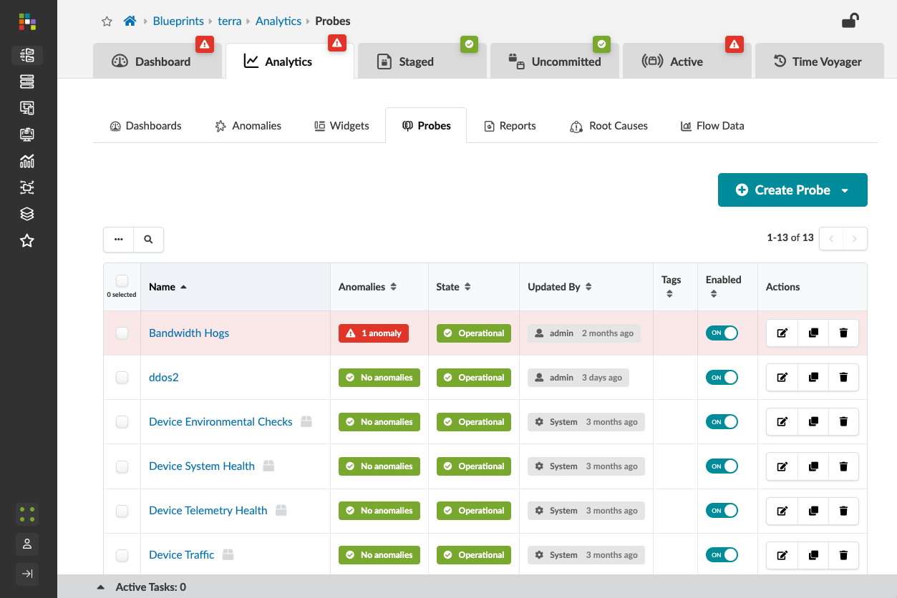

## Create Probe from 'New Probe'
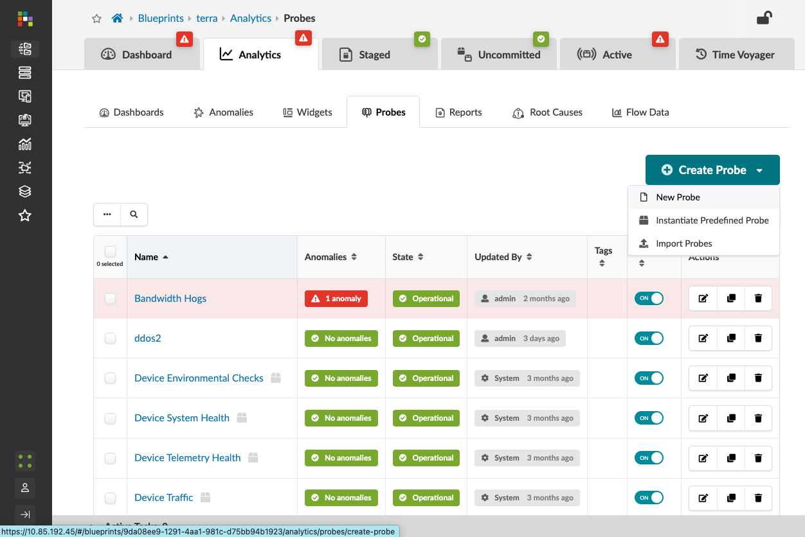

## Name the probe
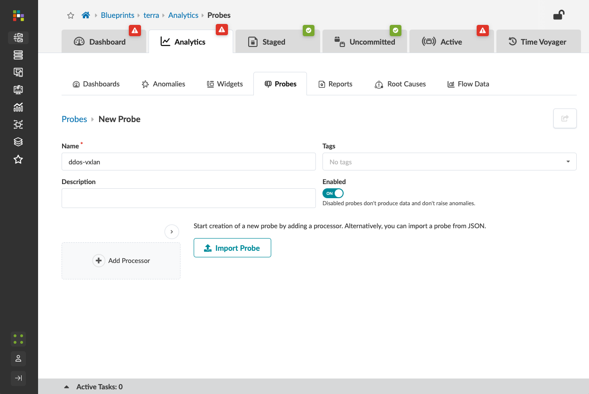

## Add a Processor
- Probe Type: Extensible Service Data Collector
- Processor Name: ddos-vxlan
- Output Stage Name: ddos-vxlqn
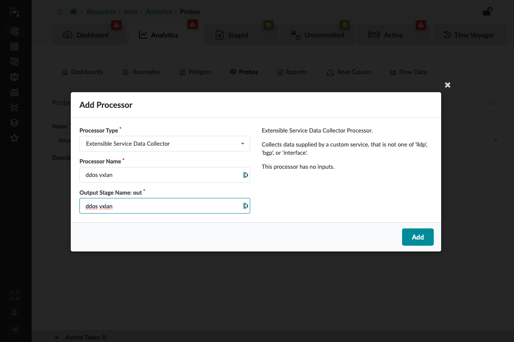

## Update Graph Query
- Predefined Query: DC - All leafs and access switches
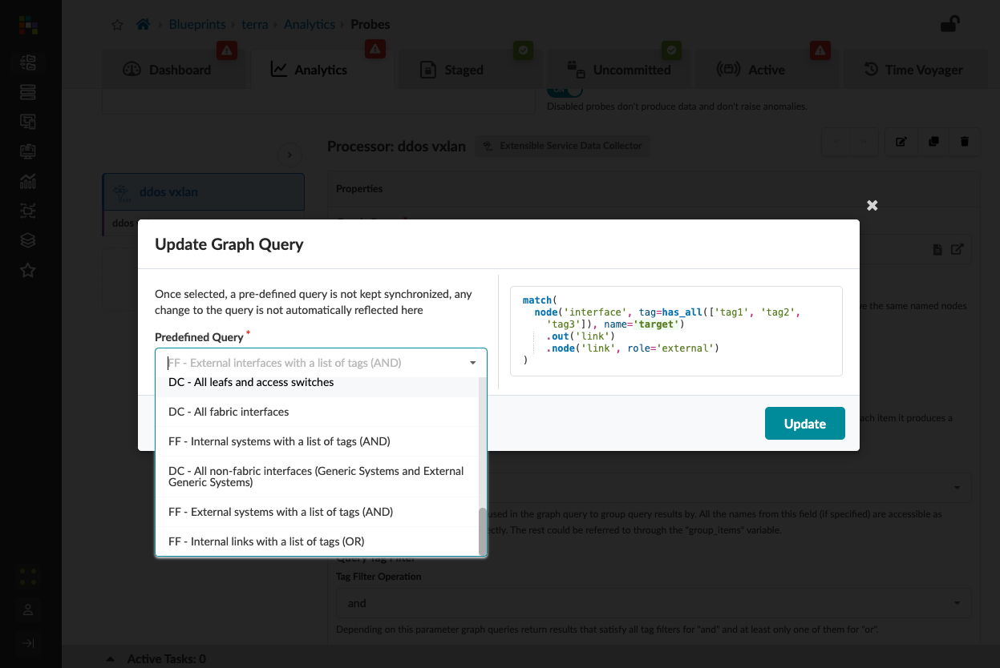

## Update the Processor
- Query Group By: system (optional)
- System ID: system.system_id (depends on the query)
- Service Name: ddos-vxlan (the service defined earlier)
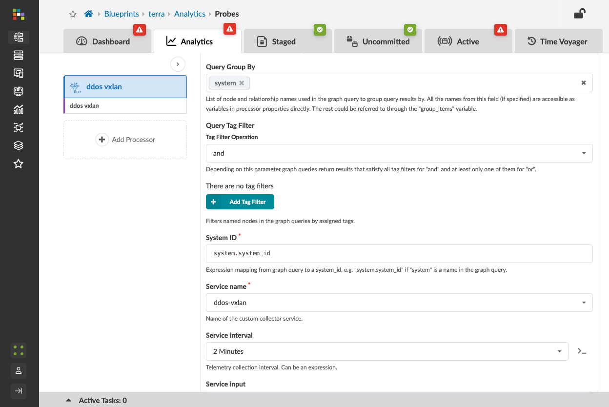

## Data Type
- Data Type: Dynamic Number
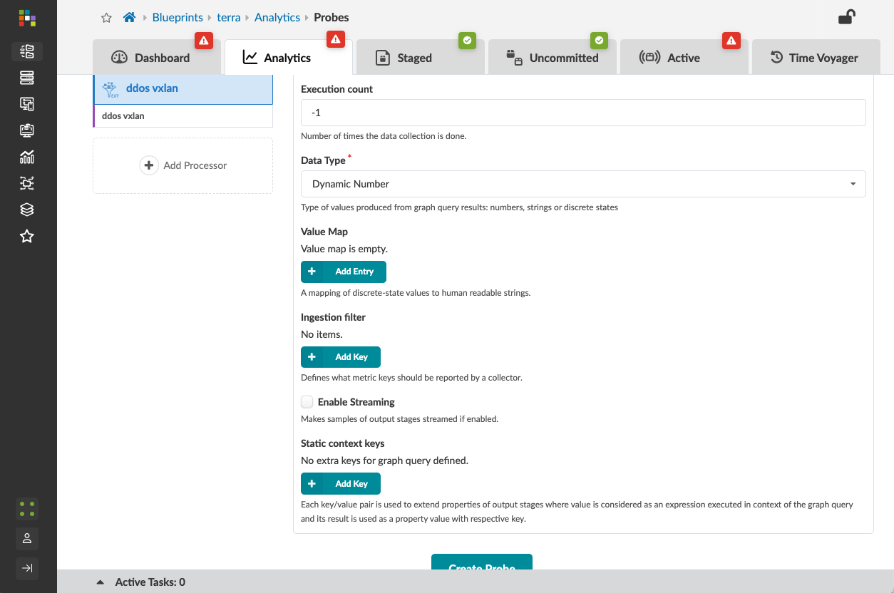

## Inspect Output Stage ddos vxlan
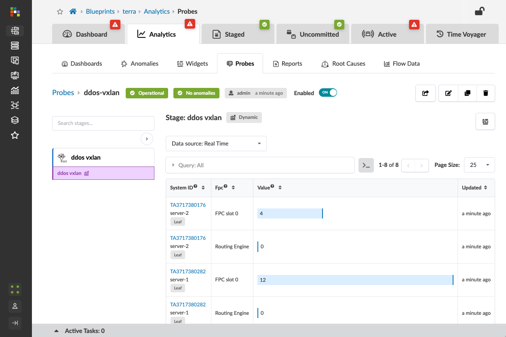

## Add Processor - Range
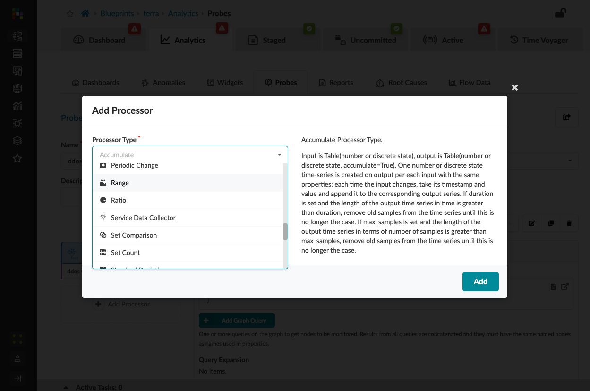

## Set Range
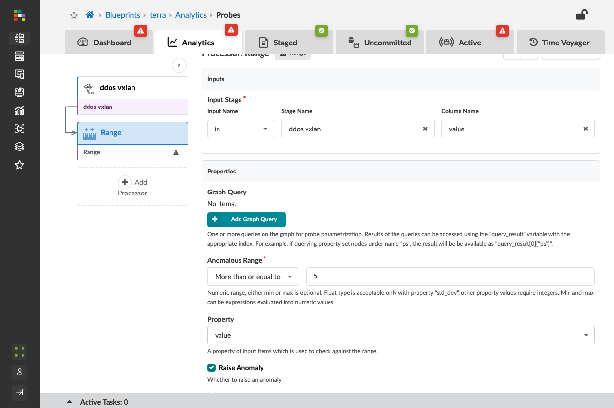

## Inspect the Range Stage
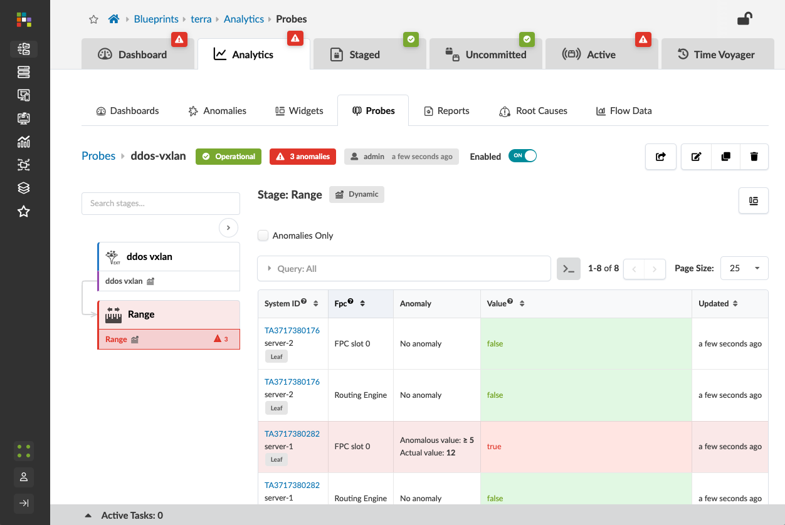

