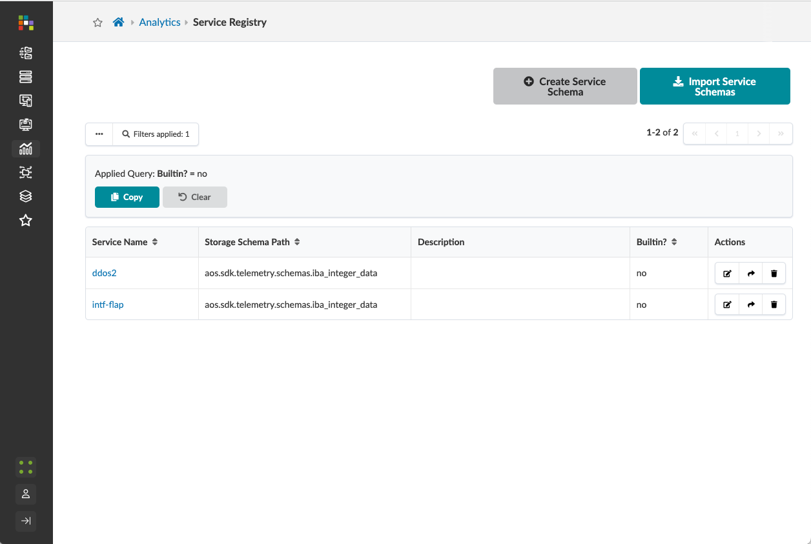
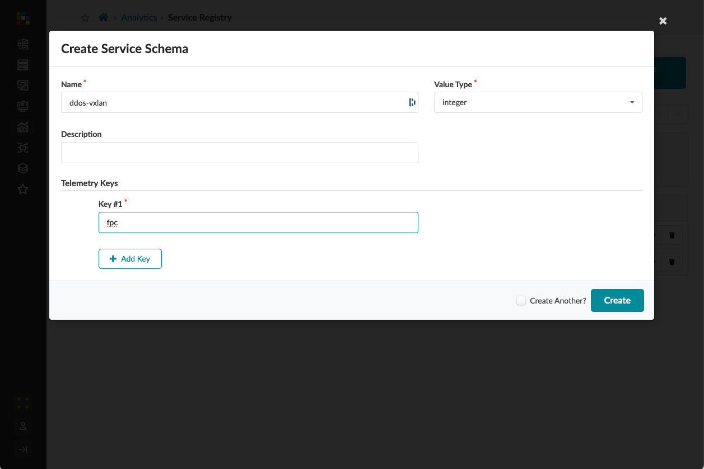

# ddos-protection
Demonstration of the steps to create an Analytics Probe for the arrival max of shell command output of ddos-protection vxlan 

# Sourece data

The xml data can be captured by the command
```
show ddos-protection protocols vxlan statistics |display xml
```

[The xml output example from the cli command](./sources/show-ddos.xml)


Target is to capture packet-arrival-rate-max


# 1. Service Registry

## From Service Registry Page


## Create a Service Registry
- Name: ddos-vxlan
- Value Type: integer
- Key #1: fpc


# [2. Collector](README-collector.md)

# [3. Probes](README-probe.md)


